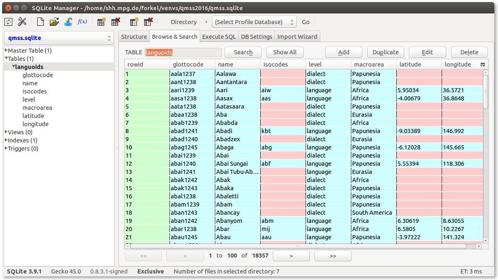

# Importing CSV

Now we insert the data into a relational database for further analysis.

Note: An sqlite database file pre-loaded with the two datasets is available as `qmss.sqlite`
in [this repository](data/).

## Using SQLite Manager

Unfortunately the CSV import of SQLite Manager (0.8.3) does not handle single quotes in the
data well. The single quote `'` is a delimiter in SQL, thus has to be escaped as `\'` when
used within string literals in SQL. So before importing the data from Glottolog into SQLite Manager,
we need to fix this:

```python
$ python
Python 3.4.3 (default, Oct 14 2015, 20:28:29)
>>> c = open('data/languages-and-dialects-geo.csv', encoding='utf8').read()
>>> with open('data/languages-and-dialects-geo-quoted.csv', 'w', encoding='utf8') as fp:
...   fp.write(c.replace("'", "\\'"))
... 
```

Choose
> Database -> New Database 
then give a name and directory where to store the DB.

Then
> Database -> Import
will open the *Import Wizard* pane, where you input the data shown below


You are then prompted to edit the table's schema


After importing the data, you should be able to browse the table:



Same for phonemes, select VARCHAR for all!


## Using csvkit

Doing this with csvkit's `csvsql` command is easy.

We can take a peek at the table csvkit is going to create, running

```bash
$ csvsql --tables languoids -q '"' data/languages-and-dialects-geo.csv
CREATE TABLE languoids (
	glottocode VARCHAR(8) NOT NULL, 
	name VARCHAR(58), 
	isocodes VARCHAR(4), 
	level VARCHAR(8) NOT NULL, 
	macroarea VARCHAR(13), 
	latitude FLOAT, 
	longitude FLOAT
);
```

and then insert the data running

```bash
$ csvsql --tables languoids --insert -q '"' --db=sqlite:///qmss.sqlite data/languages-and-dialects-geo.csv
$ csvsql --tables phonemes --insert -t --db=sqlite:///qmss.sqlite data/phoible-by-phoneme.tsv 
```


## Summary

We now have an sqlite database containing two tables `languoids` and `phonemes` defined as

```sql
CREATE TABLE languoids (
	glottocode VARCHAR(8) NOT NULL, 
	name VARCHAR(58), 
	isocodes VARCHAR(4), 
	level VARCHAR(8) NOT NULL, 
	macroarea VARCHAR(13), 
	latitude FLOAT, 
	longitude FLOAT
);
```

and 

```sql
CREATE TABLE phonemes (
	"LanguageCode" VARCHAR(3) NOT NULL, 
	"LanguageName" VARCHAR(79) NOT NULL, 
	"SpecificDialect" VARCHAR(51), 
	"Phoneme" VARCHAR(11) NOT NULL, 
	"Allophones" VARCHAR(34), 
	"Source" VARCHAR(6) NOT NULL, 
	"GlyphID" VARCHAR(54) NOT NULL, 
	"InventoryID" INTEGER NOT NULL, 
	tone VARCHAR(4), 
	stress VARCHAR(4), 
	syllabic VARCHAR(4), 
	short VARCHAR(4), 
	long VARCHAR(4), 
	consonantal VARCHAR(4), 
	sonorant VARCHAR(7), 
	continuant VARCHAR(5), 
	"delayedRelease" VARCHAR(4), 
	approximant VARCHAR(4), 
	tap VARCHAR(4), 
	trill VARCHAR(4), 
	nasal VARCHAR(7), 
	lateral VARCHAR(4), 
	labial VARCHAR(5), 
	round VARCHAR(4), 
	labiodental VARCHAR(4), 
	coronal VARCHAR(5), 
	anterior VARCHAR(4), 
	distributed VARCHAR(4), 
	strident VARCHAR(5), 
	dorsal VARCHAR(5), 
	high VARCHAR(5), 
	low VARCHAR(5), 
	front VARCHAR(5), 
	back VARCHAR(5), 
	tense VARCHAR(4), 
	"retractedTongueRoot" VARCHAR(4), 
	"advancedTongueRoot" VARCHAR(4), 
	"periodicGlottalSource" VARCHAR(5), 
	"epilaryngealSource" VARCHAR(4), 
	"spreadGlottis" VARCHAR(4), 
	"constrictedGlottis" VARCHAR(4), 
	fortis VARCHAR(4), 
	"raisedLarynxEjective" VARCHAR(4), 
	"loweredLarynxImplosive" VARCHAR(4), 
	click VARCHAR(4)
);
```

Each row in the `languoids` table contains information about a different language or dialect.

Each row in the `phonemes` table contains information about one phoneme encountered in a phoneme
inventory associated with a language.

Database fields are explicitely typed (as opposed to columns in CSV files).
