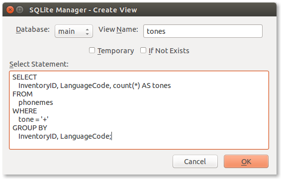
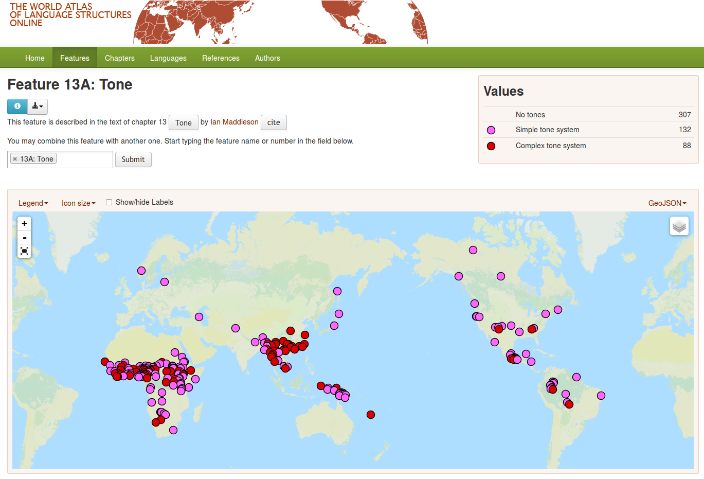

# Querying the database

Now we can inspect the data either running `sqlite3 qmss.sqlite` 

```sql
$ sqlite3 qmss.sqlite 
SQLite version 3.8.2 2013-12-06 14:53:30
Enter ".help" for instructions
Enter SQL statements terminated with a ";"
sqlite> SELECT count(*) FROM languoids;
18357
```

or by typing SQL
into SQLite Manager's *Execute SQL* pane.


Querying or selecting rows in a table is done using SQL's `SELECT` command, specifying the 
fields you want to retrieve and the name of the table, e.g.

```sql
SELECT glottocode, name, macroarea FROM languoids;
```

will return results as follows:

<table>
<TR><TH>glottocode</TH>
<TH>name</TH>
<TH>macroarea</TH>
</TR>
<TR><TD>aala1237</TD>
<TD>Aalawa</TD>
<TD>Papunesia</TD>
</TR>
<TR><TD>aant1238</TD>
<TD>Aantantara</TD>
<TD>Papunesia</TD>
</TR>
<TR><TD>aari1239</TD>
<TD>Aari</TD>
<TD>Africa</TD>
</TR>
<TR><TD>aasa1238</TD>
<TD>Aasax</TD>
<TD>Africa</TD>
</TR>
<TR><TD>aata1238</TD>
<TD>Aatasaara</TD>
<TD>Papunesia</TD>
</TR>
</table>

SQL provides keywords and construct to manipulate queries allowing
- [sorting](http://swcarpentry.github.io/sql-novice-survey/02-sort-dup.html)
- [filtering](http://swcarpentry.github.io/sql-novice-survey/03-filter.html)
- [calculating of new values](http://swcarpentry.github.io/sql-novice-survey/04-calc.html)
- [aggregating](http://swcarpentry.github.io/sql-novice-survey/06-agg.html)
- [combining data](http://swcarpentry.github.io/sql-novice-survey/07-join.html)
some of which we will encounter below when examining the data in our two tables.

We want to combine information about macroareas from table `languoids` with information about
tones in table `phonemes`.

So let's first examine how the information about macroareas is coded. We use the `DISTINCT` 
keyword to remove duplicate rows from the query results.

```sql
SELECT DISTINCT macroarea FROM languoids;
```

reults in 

<table>
<TR><TH>macroarea</TH>
</TR>
<TR><TD>Papunesia</TD>
</TR>
<TR><TD>Africa</TD>
</TR>
<TR><TD>Eurasia</TD>
</TR>
<TR><TD>South America</TD>
</TR>
<TR><TD>North America</TD>
</TR>
<TR><TD>Australia</TD>
</TR>
<TR><TD></TD>
</TR>
</table>

So there are 6 macroareas associated with languoids. But does each row have a macroarea coded?
To find out, we need to know a bit about how databases handle 
[missing data](http://swcarpentry.github.io/sql-novice-survey/05-null.html).
A missing value for a field is indicated by `null`, the "null value". To make these values more
easily visible in the terminal, we can set

```sql
sqlite> . nullvalue <null>
sqlite> SELECT DISTINCT macroarea FROM languoids;
Papunesia
Africa
Eurasia
South America
North America
Australia
<null>
```

Note that `null` is not really a value, though, e.g.
```sql
sqlite> SELECT count(DISTINCT macroarea) FROM languoids;
6
sqlite> select count(*) from languoids where macroarea = null;
0
sqlite> select count(*) from languoids where macroarea is null;
60
```

We have used the aggregation function `count` to aggregate information from all rows of the
result set.

We can examine the information about tones in the `phonemes` table in the same way:

```sql
sqlite> SELECT DISTINCT tone FROM phonemes;
0
+
NA
```

So a phoneme is coded as being associated with tone by a value of `+`.
How many of these are there?

```sql
sqlite> SELECT count(*) FROM phonemes WHERE tone = '+';
2007
```

We used a `WHERE` clause to filter the set of phonemes by a certain value for one field.

In how many languages do they occur?

```sql
sqlite> SELECT count(distinct LanguageCode) FROM phonemes WHERE tone = '+';
526
```

So there are languages with more than one tonal phoneme. We can group phonemes by language
or more precisely by inventory and then count the number of grouped phonemes as follows:

```sql
SELECT 
    InventoryID, LanguageCode, count(*) AS tones 
FROM 
    phonemes 
WHERE 
    tone = '+' 
GROUP BY 
    InventoryID, LanguageCode;
```

<table>
<TR><TH>InventoryID</TH>
<TH>LanguageCode</TH>
<TH>tones</TH>
</TR>
<TR><TD>-410</TD>
<TD>sef</TD>
<TD>3</TD>
</TR>
<TR><TD>-375</TD>
<TD>bva</TD>
<TD>2</TD>
</TR>
<TR><TD>-374</TD>
<TD>bva</TD>
<TD>3</TD>
</TR>
<TR><TD>-373</TD>
<TD>bva</TD>
<TD>3</TD>
</TR>
<TR><TD>-372</TD>
<TD>bva</TD>
<TD>3</TD>
</TR>
</table>

A convenient way to store intermediate results (in a dynamic way) is via views, which behave
much like tables. You can create a view in SQLite running the following SQL:

```sql
CREATE VIEW tones AS 
    SELECT 
        InventoryID, LanguageCode, count(*) AS tones 
    FROM 
        phonemes 
    WHERE 
        tone = '+' 
    GROUP BY 
        LanguageCode, InventoryID;
```

or in SQLite Manager select
> View -> Create View
and fill in view name and the `SELECT` statement:



So what do we know about the number of tones per language? We can use a couple more standard
aggregation functions to find out:

```sql
SELECT min(tones), max(tones), avg(tones), sum(tones)/cast(count(tones) as float) FROM tones;
```

yielding

<table>
<TR><TH>min(tones)</TH>
<TH>max(tones)</TH>
<TH>avg(tones)</TH>
<TH>sum(tones)/cast(count(tones) as float)</TH>
</TR>
<TR><TD>1</TD>
<TD>10</TD>
<TD>3.37310924369748</TD>
<TD>3.37310924369748</TD>
</TR>
</table>

Notes:
- SQLite undertands the usual arithmetic operators `+ - * /` to calculate new values.
- Fields are typed and operators or functions typically do not coerce their arguments into the
  required types. So the `cast` function is used above to make sure we are applying floating
  point division, rather than integer division (with remainder).

We can only combine information from two tables if they have something in common. In our case,
`languoids.isocodes` stores (potentially multiple) ISO codes associated with a lnaguoid, and
`tones.LanguageCode` stores single ISO codes. To match records of the two tables, we have to
further investigate the values in `languoids.isocodes`:

```
sqlite> SELECT max(length(isocodes)) FROM languoids;
3
```

Ok, so there is at most one three-letter ISO code per languoid. Let's see if these ISO codes
are all distinct:

```
sqlite> SELECT count(*) FROM languoids WHERE length(isocodes) = 3;
7361
```

```
sqlite> SELECT count(distinct isocodes) FROM languoids WHERE length(isocodes) = 3;
7361
```

Good! Having established that `languoids.isocodes` does only hold unique three-letter
ISO codes (or `null`), we can use this field to `JOIN` the two tables:

```sql
SELECT 
    macroarea, name, isocodes 
FROM 
    languoids 
JOIN 
    tones 
ON 
    isocodes = LanguageCode;
```

<table>
<TR><TH>macroarea</TH>
<TH>name</TH>
<TH>isocodes</TH>
</TR>
<TR><TD>Africa</TD>
<TD>Abar</TD>
<TD>mij</TD>
</TR>
<TR><TD>Africa</TD>
<TD>Abidji</TD>
<TD>abi</TD>
</TR>
<TR><TD>Africa</TD>
<TD>Abua</TD>
<TD>abn</TD>
</TR>
<TR><TD>Africa</TD>
<TD>Abure</TD>
<TD>abu</TD>
</TR>
<TR><TD>Africa</TD>
<TD>Acoli</TD>
<TD>ach</TD>
</TR>
</table>

Finally, we can group by macroarea to get the distribution we wanted to calculate:

```sql
SELECT 
    l.macroarea, count(t.LanguageCode) AS tone_languages 
FROM 
    languoids AS l 
JOIN 
    tones AS t 
ON 
    l.isocodes = t.LanguageCode
GROUP BY
    l.macroarea
ORDER BY
    tone_languages desc;
```

Resulting in:

<table>
<TR><TH>macroarea</TH>
<TH>tone_languages</TH>
</TR>
<TR><TD>Africa</TD>
<TD>528</TD>
</TR>
<TR><TD>Eurasia</TD>
<TD>28</TD>
</TR>
<TR><TD>North America</TD>
<TD>19</TD>
</TR>
<TR><TD>Papunesia</TD>
<TD>7</TD>
</TR>
<TR><TD>South America</TD>
<TD>6</TD>
</TR>
</table>

Which - when [compared with WALS](http://wals.info/feature/13A?v1=a000) - seems to be a plausible result:



Notes:
- A standardized query language like SQL allows re-using the same analyses tools with different
  database managers, and even with different relational databases.
- While SQL is case insensitive, it is customary to write SQL keywords like `SELECT`, `FROM`
  and `WHERE` in uppercase, to clearly distinguish them from identifiers for tables and columns.
- There is no defined default ordering of rows returned by a query. So you should always specify
  an explicit order to make query results replicable.
- SQL commands are terminated with a semicolon.


