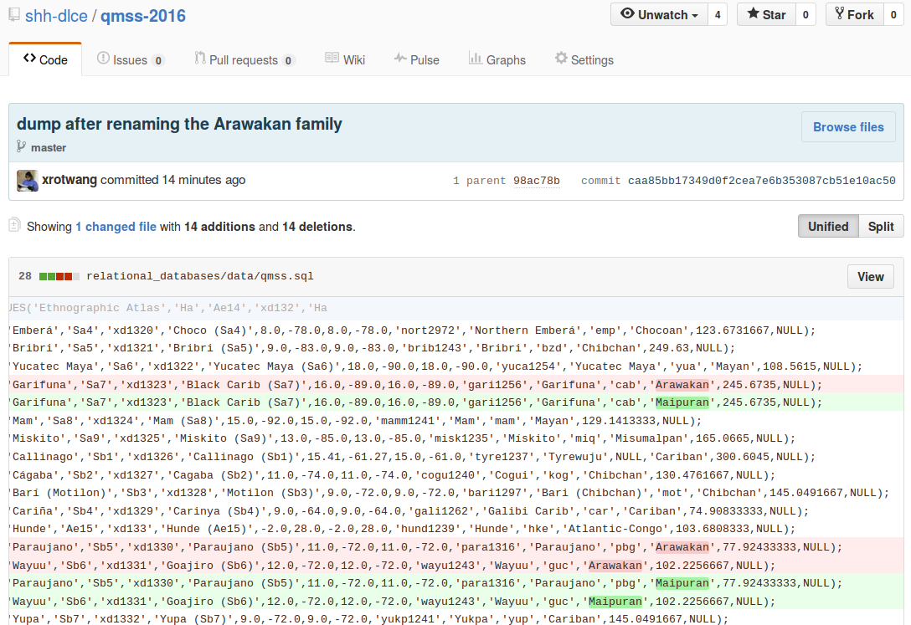

# Exporting data

## Using sqlite3

sqlite3 supports export to CSV as follows:

```bash
sqlite> .header on
sqlite> .mode csv
sqlite> .output dataset.csv
sqlite> SELECT * FROM dataset;
sqlite> .output stdout
```

## Using SQLite Manager

Choose
> View -> Export View


Configure the export, click "OK", select an output file and enjoy!


## SQLite and version control

While the sqlite database file is quite portable and could be shared e.g. using
a service like dropbox, this may not be the best option for collaboration or
backup. Since the sqlite file is a binary file, it is also not well suited for
version control systems like git.

But SQLite (like most relational databases) supports dumping a database to SQL,
which in turn is a line-based text format, perfectly suited for version control.

Thus, we can dump and restore a database to/from SQL:

```bash
$ sqlite3 qmss.sqlite .dump > qmss.sql
$ sqlite3 qmss_restored.sqlite < qmss.sql
```

This will give us all the advantages of version control to make changes to our
data transparent. E.g. updating data using SQL like

```sql
UPDATE precipitation SET Language_family = 'Maipuran' WHERE Language_family = 'Arawakan';
```

will result in a changeset of the SQL dump [looking like this](https://github.com/shh-dlce/qmss-2016/commit/caa85bb17349d0f2cea7e6b353087cb51e10ac50):




## Next section

[What's next?](06-whats-next.md)
