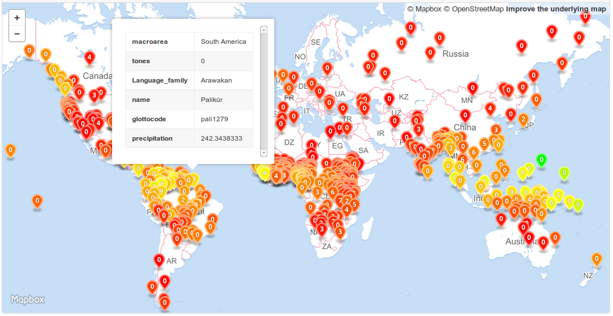

# Exporting CSV data

## Using sqlite3

sqlite3 supports export to CSV as follows:

```bash
sqlite> .header on
sqlite> .mode csv
sqlite> .output macroareas.csv
sqlite> SELECT * FROM dataset;
sqlite> .output stdout
```

## Using SQLite Manager

Choose
> View -> Export View


Configure the export, click "OK", select an output file and enjoy!


## What's next?

This CSV file could easily be converted to GeoJSON using a service such as 
[csv2geojson](http://mapbox.github.io/csv2geojson/)
for [basic visualization on a map](data/dataset.geojson).

With a bit more work in python this can be turned into a 
[visualization](data/dataset2.geojson) of
- geography
- precipitation (via marker colors)
- tonality (via marker icons)



```python
import json
import colorsys

def color(val, minval, maxval):
    h = (float(val-minval) / (maxval-minval)) * 120
    rgb = [hex(int(255 * x)) for x in colorsys.hsv_to_rgb(h/360, 1., 1.)]
    return ''.join(x[2:].upper().rjust(2, '0') for x in rgb)

def updated(d):
    precipitation = [float(f['properties']['precipitation']) for f in d['features']]
    for f in d['features']:
        props = f['properties']
        props['marker-size'] = 'small'
        props['marker-symbol'] = min([int(props['tones']), 9])
        props['marker-color'] = '#' + color(float(props['precipitation']), min(precipitation), max(precipitation))
    return d

with open('dataset.geojson') as fp:
    d = json.load(fp)
with open('dataset2.geojson', 'w') as fp:
    json.dump(updated(d), fp, indent=4)
```
