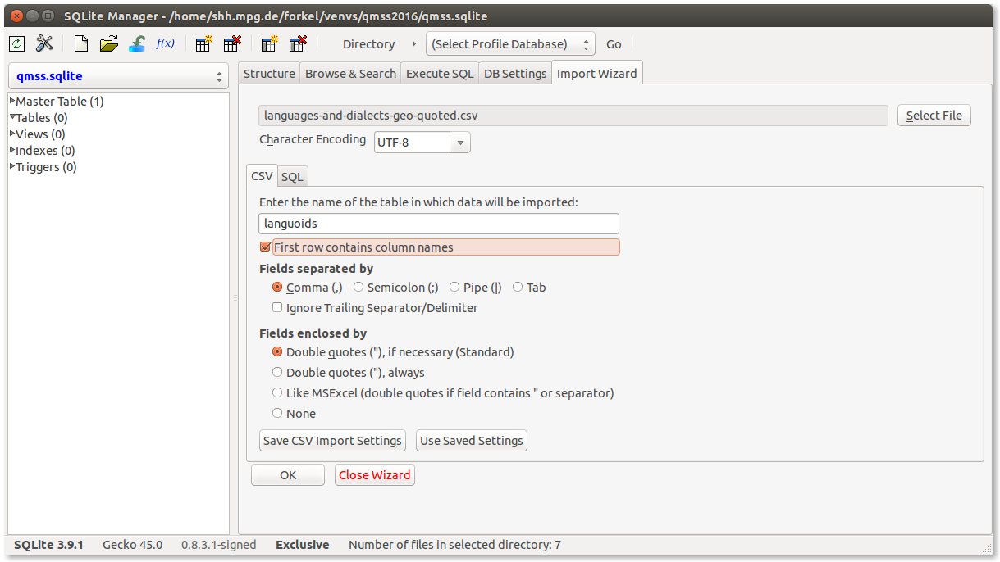
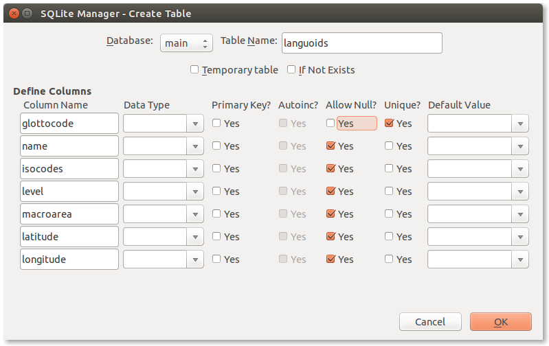
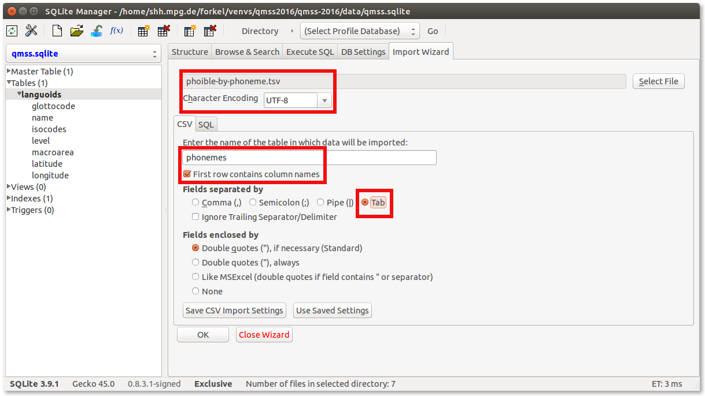

# Relational databases

## Tutorial: Data wrangling with SQLite

In this tutorial we learn how to use a relational database to merge and analyse CSV data from different sources.

The tutorial requires 
- [csvkit](https://csvkit.readthedocs.org/en/0.9.1/index.html) (optional)
- [sqlite](https://www.sqlite.org/download.html) or alternatively [SQLite Manager for Firefox](https://addons.mozilla.org/en-US/firefox/addon/sqlite-manager/)

We will use the following data:
- [Glottolog languages and dialects](data/languages-and-dialects-geo.csv) downloaded from http://glottolog.org/static/download/2.7/languages-and-dialects-geo.csv
- [PHOIBLE phoneme data](data/phoible-by-phoneme.tsv) downloaded from https://raw.githubusercontent.com/phoible/dev/master/data/phoible-by-phoneme.tsv


### Inspecting CSV data

We downloaded a CSV file containing data about languages and dialects from Glottolog and
a TSV file containing the PHOIBLE database on phoneme inventories (see [README](data/README.md)).

Let's do a crude size estimate of the Glottolog data, counting the lines in the file:

```bash
$ wc -l data/languages-and-dialects-geo.csv 
18358 data/languages-and-dialects-geo.csv
```

Now we inspect the file using csvkit's `csvstat` command.
In general it is advisable to constrain the amount of guessing csvkit has to do by specifying all we know about a CSV file. For example, [RFC 4180](https://www.ietf.org/rfc/rfc4180.txt) (the de facto specification of CSV) allows only double quote `"` as quote character (to be used in case field content contains a comma or newline).

```bash
$ csvstat -q '"' data/languages-and-dialects-geo.csv
  1. glottocode
	<class 'str'>
	Nulls: False
	Unique values: 18357
	Max length: 8
  2. name
	<class 'str'>
	Nulls: True
	Unique values: 18227
	5 most frequent values:
		Gova:	3
		Yana:	2
		Iko:	2
		Unggumi:	2
		Hamba:	2
	Max length: 58
  3. isocodes
	<class 'str'>
	Nulls: True
	Unique values: 7361
	Max length: 4
  4. level
	<class 'str'>
	Nulls: False
	Values: language, dialect
  5. macroarea
	<class 'str'>
	Nulls: True
	Unique values: 6
	5 most frequent values:
		Africa:	5911
		Eurasia:	4992
		Papunesia:	4817
		South America:	1041
		North America:	995
	Max length: 13
  6. latitude
	<class 'float'>
	Nulls: True
	Min: -55.2748
	Max: 73.1354
	Sum: 57961.53543824342
	Mean: 7.874138763516291
	Median: 6.08134
	Standard Deviation: 18.678027079778794
	Unique values: 7204
	5 most frequent values:
		23.6818:	10
		40.0:	5
		21.8375:	5
		23.086:	5
		25.0:	4
  7. longitude
	<class 'float'>
	Nulls: True
	Min: -178.785
	Max: 179.306
	Sum: 372863.3632390997
	Mean: 50.6539007253226
	Median: 45.152856
	Standard Deviation: 81.61051507133911
	Unique values: 7162
	5 most frequent values:
		107.184:	10
		107.362:	5
		103.464:	5
		10.2166:	4
		142.462:	4

Row count: 18357
```

Notes:
- The row count matches our expectation from counting the lines in the file. (It could be lower, 
  though, because CSV does allow newlines in field content.)
- csvkit also detected plausible data types for the fields; in particular, latitude and longitude
  were detected as containing floating point numbers.
- Running csvstat on the 8.2 MB PHOIBLE file with 75,388 rows takes > 10 secs on a pretty fast
  machine.


### Inserting the data into sqlite

Now we insert the data into a relational database for further analysis.


#### Using SQLite Manager

Choose

> Database -> New Database 

then give a name and directory where to store the DB.

Then

> Database -> Import

in the *Import Wizard* pane input the data shown below



You are then prompted to edit the table's schema



After importing the data, you should be able to browse the table:


Same for phonemes, select VARCHAR for all!




#### Using csvkit

Doing this with csvkit's `csvsql` command is easy.

We can take a peek at the table csvkit is going to create, running

```bash
$ csvsql --tables languoids -q '"' data/languages-and-dialects-geo.csv
CREATE TABLE languoids (
	glottocode VARCHAR(8) NOT NULL, 
	name VARCHAR(58), 
	isocodes VARCHAR(4), 
	level VARCHAR(8) NOT NULL, 
	macroarea VARCHAR(13), 
	latitude FLOAT, 
	longitude FLOAT
);
```

and then insert the data running

```bash
$ csvsql --tables languoids --insert -q '"' data/languages-and-dialects-geo.csv
$ csvsql --tables phonemes --insert -t data/languages-and-dialects-geo.csv
```


### Querying the database

Now we can inspect the data either running `sqlite3 qmss.sqlite3` or by typing SQL
into SQLite Manager's *Execute SQL* pane:

```bash
sqlite> select
   ...>     macroarea, count(glottocode) as c
   ...> from
   ...>     languoids
   ...> where
   ...>     level = 'language'
   ...> group by macroarea
   ...> order by c desc;
Africa|2239
Papunesia|2151
Eurasia|1820
North America|727
South America|647
Australia|357
|2
```


- query for tone languages per macroarea
- compare with WALS: http://wals.info/feature/13A?v1=a000


### Exporting to CSV

sqlite3 supports export to CSV as follows:

```bash
sqlite> .header on
sqlite> .mode csv
sqlite> .output macroareas.csv
sqlite> select macroarea, count(glottocode) as c from languoids where level = 'language' group by macroarea order by c desc;
sqlite> .output stdout
```

